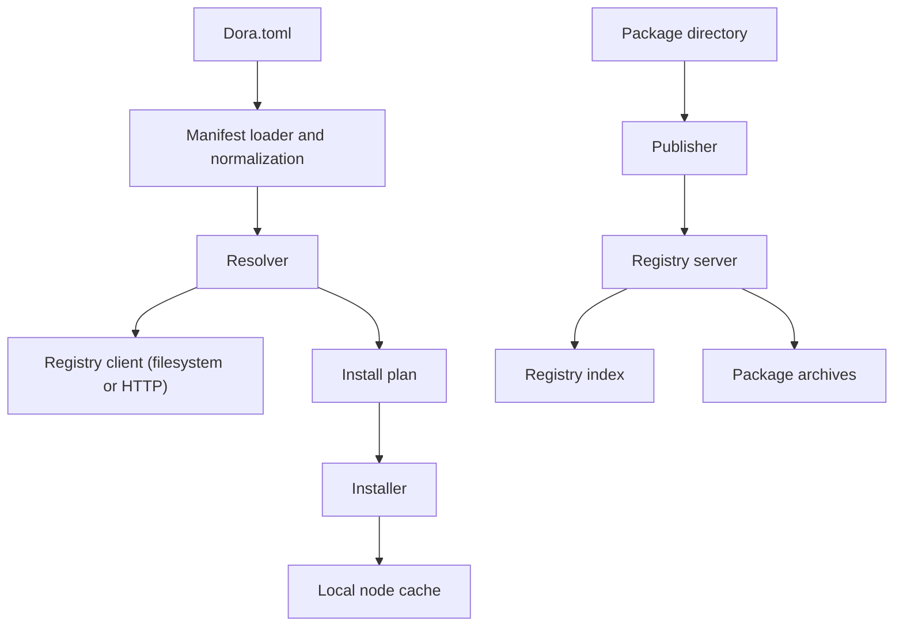

# Dora Package Ecosystem Prototype

This repository is an exploratory prototype for Dora package and dependency management. I built it while studying how a Dora-native package workflow could look in practice, especially around package metadata, dependency resolution, install and publish flows, registry layout, and reproducibility boundaries.

The prototype is heavily informed by ideas from Cargo and crates.io, but it is not intended as a direct clone of either system and it is not an official Dora repository. Its purpose is to explore design tradeoffs concretely, validate assumptions in code, and inform a narrower Dora-specific GSoC proposal.

## What This Prototype Explores

- A `Dora.toml` package contract with package metadata, node metadata, and Dora-level dependencies
- A resolver that reads registry metadata, selects compatible versions, and computes install order
- An installer that fetches package archives, validates extracted manifests, and materializes packages into a local cache
- A publisher that creates tarballs, computes checksums, and uploads package metadata plus artifacts to a registry API
- A simple registry model with:
  - a flat package index
  - packaged artifacts
  - filesystem and HTTP-backed access patterns
- Example Dora packages across Python and Rust

## Why I Built It

Before Dora's GSoC package-management idea was later narrowed toward a smaller Dora-specific prototype, I wanted to explore the larger design space in code rather than only at the discussion level.

This prototype helped me reason about:

- what belongs in `Dora.toml` versus language-native manifests such as `Cargo.toml` or `pyproject.toml`
- how a Dora-level resolver should differ from language-native package managers
- what a minimal install and publish round-trip looks like
- how a registry index and package archive store can be separated
- what responsibilities a Dora-level lockfile should and should not take on
- where local caching and validation need to happen for reproducible installs

## Current Components

| Component | Location | Purpose |
| --- | --- | --- |
| CLI prototype | `crates/dora-cli` | Exposes `install` and `publish` commands |
| Package manager | `crates/package-manager` | Manifest loading, resolution, install flow, and publish flow |
| Registry client | `crates/registry-client` | Reads registry metadata from filesystem or HTTP |
| Registry server | `crates/registry-server` | Minimal Axum server for index/package access and publishing |
| Sample registry data | `registry/` | Flat registry index plus packaged artifacts |
| Example packages | `examples/` | Dora packages used to test manifest shape and workflow ideas |

## Architecture Overview



## Package Flow

### Install flow

1. Read the requested package name.
2. Resolve dependencies from the registry index.
3. Select compatible versions and compute install order.
4. Download or read package archives.
5. Extract into the local cache.
6. Validate the extracted `Dora.toml` against registry metadata.

### Publish flow

1. Read and validate `Dora.toml`.
2. Package the node directory into a `.tar.gz` archive.
3. Compute a checksum for the archive.
4. Send package metadata and artifact to the registry server.
5. Update the registry index and package storage.

## Example `Dora.toml`

```toml
[package]
name = "dora-yolo"
version = "0.1.0"

[node]
language = "python"
entrypoint = "dora_yolo/main.py"

[dependencies]
dora-camera = "^0.1.0"
```

## Running the Prototype

### Run tests

```powershell
cargo test --workspace
```

### Start the registry server

```powershell
cargo run -p registry-server
```

### Install a package from the sample registry

```powershell
cargo run -p dora-cli -- install dora-rerun
```

### Publish a package to the local registry server

```powershell
cargo run -p dora-cli -- publish examples/terminal-print
```

## What I Learned

- Dora-level metadata is useful, but it should complement native manifests rather than replace them.
- A Dora resolver should focus on Dora package provenance and package-to-package relationships, not duplicate every feature of Cargo or Python tooling.
- Install and publish workflows become much clearer when index metadata, package archives, and local cache responsibilities are separated.
- Validation at extraction time is important because registry metadata and packaged manifests can drift.
- A realistic Dora proposal should focus on a working prototype rather than a production-grade package manager.

## Why The Final Proposal Is Narrower

This prototype explores a broader design space than the final GSoC proposal should attempt in one summer. After the official project direction was refined toward a smaller Dora-specific prototype, I narrowed the implementation plan around:

- Dora-level metadata
- reproducible package provenance
- Python-first runtime isolation
- minimal `install` and `publish` workflows
- documentation and examples

That narrower scope is more realistic for GSoC and better aligned with Dora's current needs.

## Notes

- This repository is an exploratory prototype, not a production-ready package manager.
- It is best used as a supporting reference for design thinking and implementation exploration.
- The final Dora proposal intentionally focuses on a smaller, better-scoped subset of these ideas.
